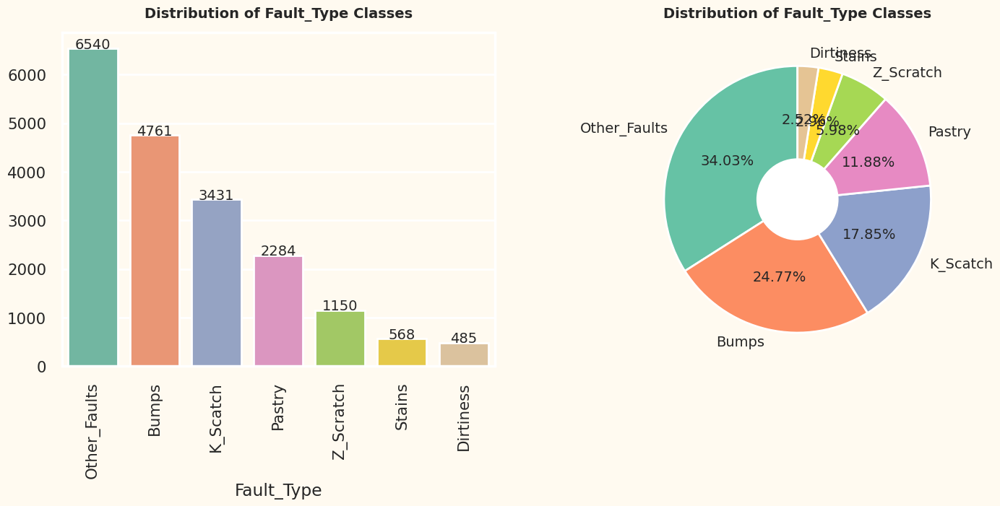
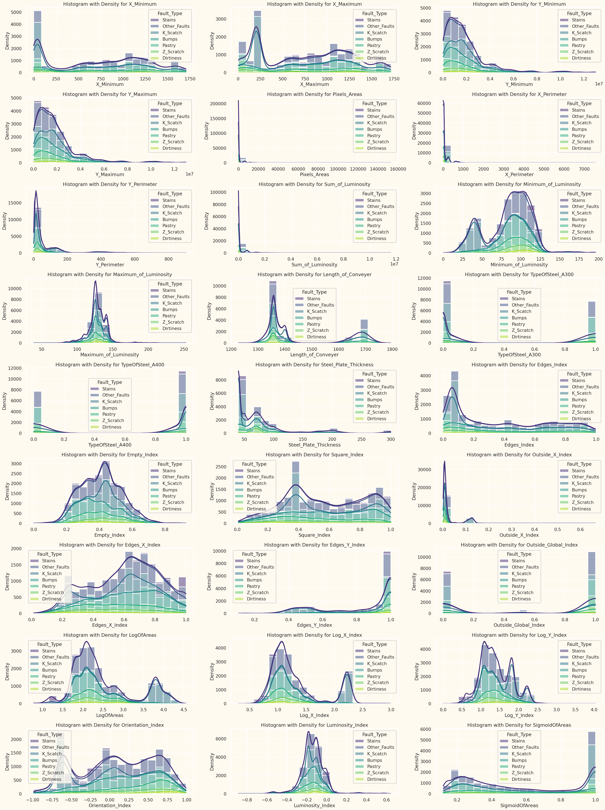
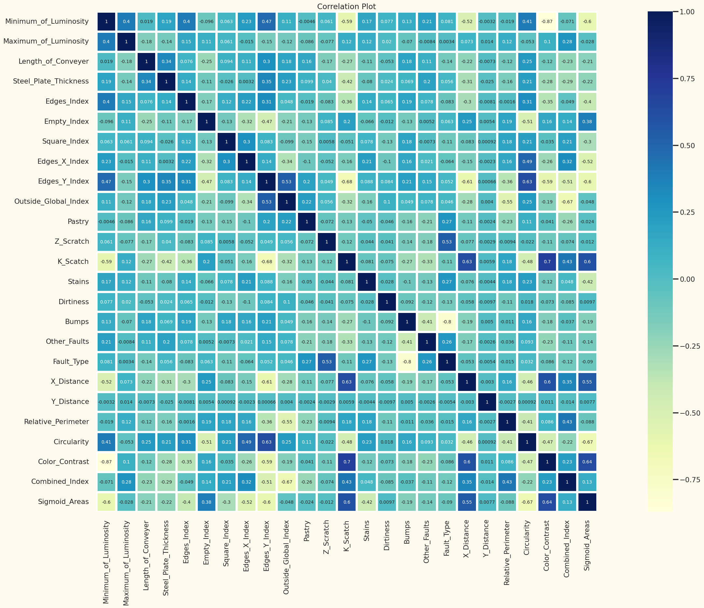

# Steel Plate Defect Prediction

## Table of Contents

- [Steel Plate Defect Prediction](#steel-plate-defect-prediction)
  - [Table of Contents](#table-of-contents)
  - [Introduction](#introduction)
  - [Kaggle Leaderboard](#kaggle-leaderboard)
  - [Data Cleaning and Handling Missing Values](#data-cleaning-and-handling-missing-values)
  - [Exploratory Data Analysis (EDA)](#exploratory-data-analysis-eda)
    - [Pie plot of types of faults](#pie-plot-of-types-of-faults)
    - [Histogram with KDE of all the numerical columns](#histogram-with-kde-of-all-the-numerical-columns)
    - [Correlation matrix](#correlation-matrix)
  - [Hyperparameter tuning](#hyperparameter-tuning)
  - [Voting Classifier Ensemble Method](#voting-classifier-ensemble-method)

## Introduction

- **Competition Title**: Steel Plate Defect Prediction
- **Goal**: Predict defects in steel plates using machine learning techniques
- **Approach**:
  - Utilized XGBoost, CatBoost, and LightGBM 
  - Ensembled the best performing models.
  - Achieved an accuracy of 0.88905 on the test dataset

## Kaggle Leaderboard

- **Ranking**: 70 out of 2199 participants, in the top 0.03 percent.
- 


## Data Cleaning and Handling Missing Values

- Conducted comprehensive data cleaning to address inconsistencies and errors.
- Implemented custom functions for efficient cleaning of the columns.

## Exploratory Data Analysis (EDA)

Insights were derived through various visualizations:

### Pie plot of types of faults


### Histogram with KDE of all the numerical columns


### Correlation matrix


## Hyperparameter tuning

To find the optimal hyperparameters for the XGBoost model, I used a manual tuning approach. I started with a set of default parameters and then iteratively adjusted the values of the hyperparameters one by one, evaluating the model's performance after each change.

```python
xgb_best_params_for_y7 = {
'max_depth': 4,
'n_estimators': 663,
'gamma': 0.6429564571848232,
'reg_alpha': 0.3267006339507057,
'reg_lambda': 0.04658361960102192,
'min_child_weight': 6,
'subsample': 0.9939674566310442,
'colsample_bytree': 0.1435958193323451,
'learning_rate': 0.24960789830790053
}
```

## Voting Classifier Ensemble Method

- **Description**: The Voting Classifier is an ensemble learning method that combines the predictions of multiple base classifiers to make final predictions.
  
- **Components**:
  1. **Estimators**: Base classifiers are provided as tuples containing a unique name and the trained model object.
  2. **Voting Method**: Determines how final predictions are computed ('hard' or 'soft').
  3. **Flatten Transform (Optional)**: Flattens the output of each classifier before combining.

  
- **Considerations**:
  - Diversity of Base Models
  - Computational Complexity
  - Interpretability
  
- **Example Usage**:
```python
from sklearn.ensemble import VotingClassifier

ensemble_model_for_y7 = VotingClassifier(
    estimators=[
        ('xgb', xgb_model_for_y7),
        ('catboost', cb_model_for_y7),
        ('LGBM', lgbm_model_for_y7)
    ],
    voting='soft',
    flatten_transform=True
)

ensemble_model_for_y7.fit(X_train, y_train)
```
